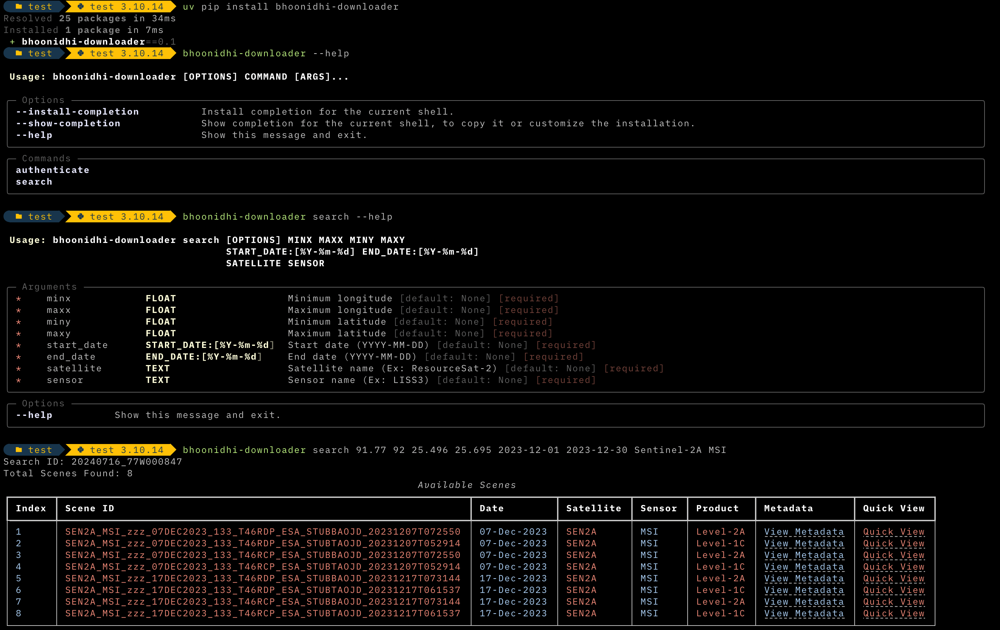

# Bhoonidhi Downloader

[](https://badge.fury.io/py/bhoonidhi-downloader) [](https://geovicco-dev.github.io/bhoonidhi-downloader/) [](https://bhoonidhi-satellite-footprint-viewer.streamlit.app/)

A Python CLI tool for searching and downloading satellite imagery from Bhoonidhi Browse & Order Portal.

## Installation

```shell
pip install bhoonidhi-downloader
```

## Usage

Basic usage:

**Authenticate**:

```shell
bhoonidhi-downloader authenticate <username> --password <password>
```

**Search Scenes using Bounding Box Coordinates**:

```shell
bhoonidhi-downloader search <minx> <maxx> <miny> <maxy> <start_date> <end_date> <satellite> <sensor>
```

Example - downloading a Sentinel-2A MSI scene from from December 2023 for Shillong, Meghalaya:

```shell
bhoonidhi-downloader search 91.77 92 25.496 25.695 2023-12-01 2023-12-30 Sentinel-2A MSI
```

For more information, use the `--help` option:

**Display Bhoonidhi Browse & Order Archive**:

```shell
bhoonidhi-downloader archive
```

The `archive` command displays a table that listing all available satellites and their corresponding sensors along with information about availability, spatial resolution, and access level. The information can be filtered by satellite and sensor using the `--sat` options.

Example - Displaying all available sensors and their information for ResourceSat-2 satellite:

```shell
bhoonidhi-downloader archive --sat ResourceSat-2
```

## Features

1. Allows secure login to Bhoonidhi Portal with session management for subsequent operations.
2. Capable of searching for scenes using bounding box coordinates (lat/lon), filter by date range and specific satellite and sensor types
3. Displays all available satellites and sensors from Bhoonidhi Archive along withtheir availability, spatial resolution, and access level.
4. Automatically filters for and displays only open data scenes available for direct download.
5. Presents search results along with metadata and quicklook images (clickable links) in a formatted table.
6. Ability to export search results as CSV, JSON, or Markdown table.
7. Multi-scene downloads - Users can choose specific scenes to download from the search results



### Limitations

- Supports only bounding box-based search for scenes.
  - Future support for search based on point coordinates and shapefile is planned.
- Supports only scenes with direct download links
- Supports only Low and Medium resolution scenes from Optical and Microwave Satellite Sensors.
  - Planning to add support for other sensors in future.
- Direct downloads only work for images from recent past - upto a year or so depending on the area and sensor. To download scenes dated ealier than that, using the [Bhoonidhi Portal](https://bhoonidhi.nrsc.gov.in/bhoonidhi/index.html#) is recommended.
  - Planning to add support for interacting with carts by way of viewing, adding, deleting items in future. This will help with downloading older scenes.
