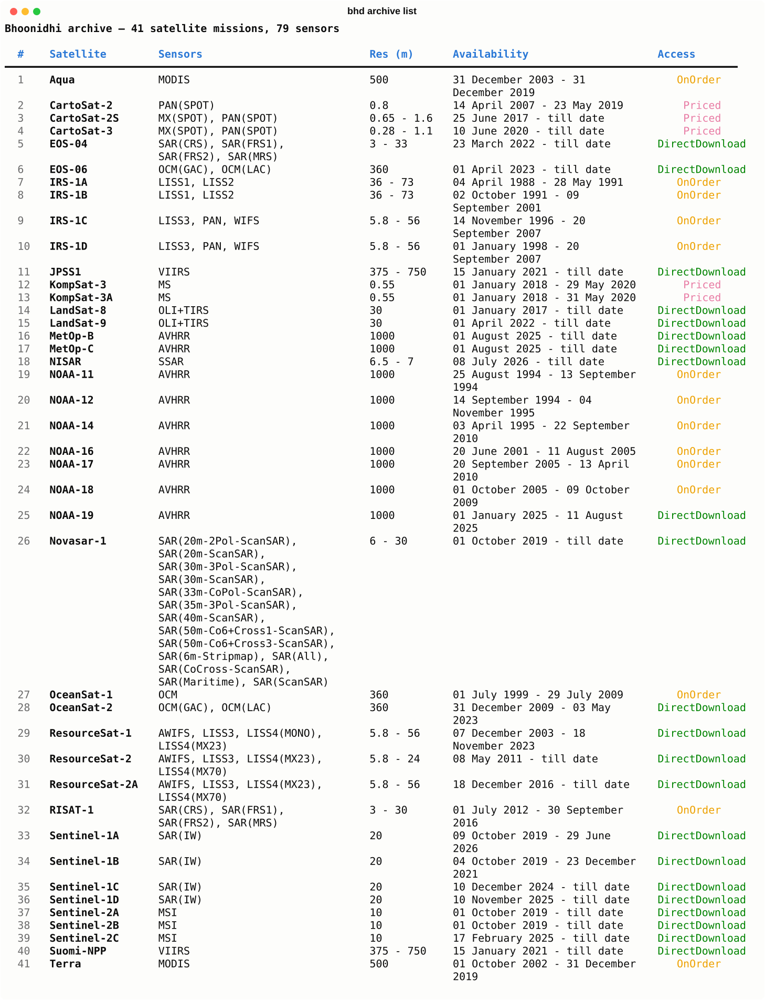

# Supported satellite missions

The Bhoonidhi archive currently spans **41 satellite missions and 79 sensors**,
from Indian missions (ResourceSat, NISAR, CartoSat, EOS, Oceansat, RISAT) to
international ones (Sentinel, Landsat, NOAA, MODIS).

!!! note "Snapshot taken on 2026-08-18"
    This list is a snapshot. The catalogue is fetched live from the portal, so
    it can change — run `bhd archive list` yourself for the current archive, or
    `bhd archive list --sat <name>` to see every sensor and product for one mission.

The **Access** column shows how a mission's data is obtained: *DirectDownload*
(openly available, fetched with `bhd query download`), *OnOrder* (openly
available but requested through the portal first), or *Priced* (paid data).

| # | Satellite | Sensors | Res (m) | Availability | Access |
| --- | --- | --- | --- | --- | --- |
| 1 | Aqua | MODIS | 500 | 31 December 2003 - 31 December 2019 | OnOrder |
| 2 | CartoSat-2 | PAN(SPOT) | 0.8 | 14 April 2007 - 23 May 2019 | Priced |
| 3 | CartoSat-2S | MX(SPOT), PAN(SPOT) | 0.65 - 1.6 | 25 June 2017 - till date | Priced |
| 4 | CartoSat-3 | MX(SPOT), PAN(SPOT) | 0.28 - 1.1 | 10 June 2020 - till date | Priced |
| 5 | EOS-04 | SAR(CRS), SAR(FRS1), SAR(FRS2), SAR(MRS) | 3 - 33 | 23 March 2022 - till date | DirectDownload |
| 6 | EOS-06 | OCM(GAC), OCM(LAC) | 360 | 01 April 2023 - till date | DirectDownload |
| 7 | IRS-1A | LISS1, LISS2 | 36 - 73 | 04 April 1988 - 28 May 1991 | OnOrder |
| 8 | IRS-1B | LISS1, LISS2 | 36 - 73 | 02 October 1991 - 09 September 2001 | OnOrder |
| 9 | IRS-1C | LISS3, PAN, WIFS | 5.8 - 56 | 14 November 1996 - 20 September 2007 | OnOrder |
| 10 | IRS-1D | LISS3, PAN, WIFS | 5.8 - 56 | 01 January 1998 - 20 September 2007 | OnOrder |
| 11 | JPSS1 | VIIRS | 375 - 750 | 15 January 2021 - till date | DirectDownload |
| 12 | KompSat-3 | MS | 0.55 | 01 January 2018 - 29 May 2020 | Priced |
| 13 | KompSat-3A | MS | 0.55 | 01 January 2018 - 31 May 2020 | Priced |
| 14 | LandSat-8 | OLI+TIRS | 30 | 01 January 2017 - till date | DirectDownload |
| 15 | LandSat-9 | OLI+TIRS | 30 | 01 April 2022 - till date | DirectDownload |
| 16 | MetOp-B | AVHRR | 1000 | 01 August 2025 - till date | DirectDownload |
| 17 | MetOp-C | AVHRR | 1000 | 01 August 2025 - till date | DirectDownload |
| 18 | NISAR | SSAR | 6.5 - 7 | 08 July 2026 - till date | DirectDownload |
| 19 | NOAA-11 | AVHRR | 1000 | 25 August 1994 - 13 September 1994 | OnOrder |
| 20 | NOAA-12 | AVHRR | 1000 | 14 September 1994 - 04 November 1995 | OnOrder |
| 21 | NOAA-14 | AVHRR | 1000 | 03 April 1995 - 22 September 2010 | OnOrder |
| 22 | NOAA-16 | AVHRR | 1000 | 20 June 2001 - 11 August 2005 | OnOrder |
| 23 | NOAA-17 | AVHRR | 1000 | 20 September 2005 - 13 April 2010 | OnOrder |
| 24 | NOAA-18 | AVHRR | 1000 | 01 October 2005 - 09 October 2009 | OnOrder |
| 25 | NOAA-19 | AVHRR | 1000 | 01 January 2025 - 11 August 2025 | DirectDownload |
| 26 | Novasar-1 | SAR(20m-2Pol-ScanSAR), SAR(20m-ScanSAR), SAR(30m-3Pol-ScanSAR), SAR(30m-ScanSAR), SAR(33m-CoPol-ScanSAR), SAR(35m-3Pol-ScanSAR), SAR(40m-ScanSAR), SAR(50m-Co6+Cross1-ScanSAR), SAR(50m-Co6+Cross3-ScanSAR), SAR(6m-Stripmap), SAR(All), SAR(CoCross-ScanSAR), SAR(Maritime), SAR(ScanSAR) | 6 - 30 | 01 October 2019 - till date | DirectDownload |
| 27 | OceanSat-1 | OCM | 360 | 01 July 1999 - 29 July 2009 | OnOrder |
| 28 | OceanSat-2 | OCM(GAC), OCM(LAC) | 360 | 31 December 2009 - 03 May 2023 | DirectDownload |
| 29 | ResourceSat-1 | AWIFS, LISS3, LISS4(MONO), LISS4(MX23) | 5.8 - 56 | 07 December 2003 - 18 November 2023 | DirectDownload |
| 30 | ResourceSat-2 | AWIFS, LISS3, LISS4(MX23), LISS4(MX70) | 5.8 - 24 | 08 May 2011 - till date | DirectDownload |
| 31 | ResourceSat-2A | AWIFS, LISS3, LISS4(MX23), LISS4(MX70) | 5.8 - 56 | 18 December 2016 - till date | DirectDownload |
| 32 | RISAT-1 | SAR(CRS), SAR(FRS1), SAR(FRS2), SAR(MRS) | 3 - 30 | 01 July 2012 - 30 September 2016 | OnOrder |
| 33 | Sentinel-1A | SAR(IW) | 20 | 09 October 2019 - 29 June 2026 | DirectDownload |
| 34 | Sentinel-1B | SAR(IW) | 20 | 04 October 2019 - 23 December 2021 | DirectDownload |
| 35 | Sentinel-1C | SAR(IW) | 20 | 10 December 2024 - till date | DirectDownload |
| 36 | Sentinel-1D | SAR(IW) | 20 | 10 November 2025 - till date | DirectDownload |
| 37 | Sentinel-2A | MSI | 10 | 01 October 2019 - till date | DirectDownload |
| 38 | Sentinel-2B | MSI | 10 | 01 October 2019 - till date | DirectDownload |
| 39 | Sentinel-2C | MSI | 10 | 17 February 2025 - till date | DirectDownload |
| 40 | Suomi-NPP | VIIRS | 375 - 750 | 15 January 2021 - till date | DirectDownload |
| 41 | Terra | MODIS | 500 | 01 October 2002 - 31 December 2019 | OnOrder |
